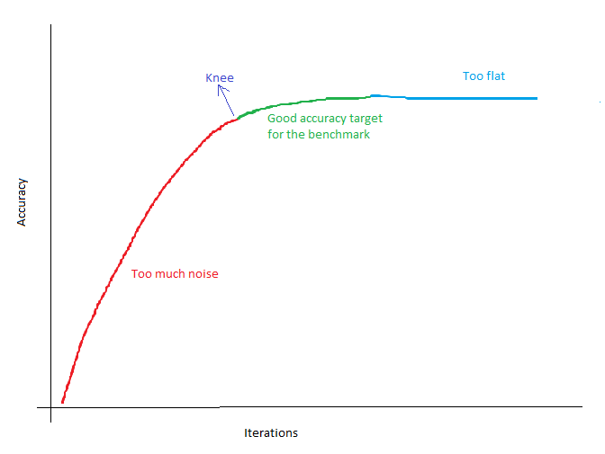
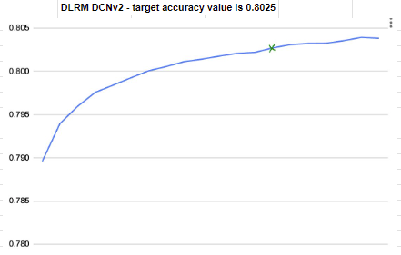
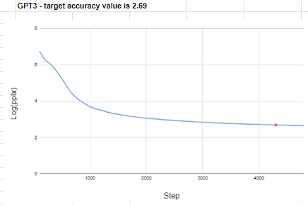

## Contributing

The best way to contribute to the MLCommons is to get involved with one of our many project communities. You find more information about getting involved with MLCommons [here](https://mlcommons.org/en/get-involved/#getting-started). 

Generally we encourage people to become a MLCommons member if they wish to contribute to MLCommons projects, but outside pull requests are very welcome too.

To get started contributing code, you or your organization needs to sign the MLCommons CLA found at the [MLC policies page](https://mlcommons.org/en/policies/). Once you or your organization has signed the corporate CLA, please fill out this [CLA sign up form](https://forms.gle/Ew1KkBVpyeJDuRw67) form to get your specific GitHub handle authorized so that you can start contributing code under the proper license.

MLCommons project work is tracked with issue trackers and pull requests. Modify the project in your own fork and issue a pull request once you want other developers to take a look at what you have done and discuss the proposed changes. Ensure that cla-bot and other checks pass for your Pull requests.

## Requirements for an MLPerf Training reference

 ### General

 1. Reference repository code must run without error on a reference platform listed below on the day of benchmark reference freeze. Reference owners are encouraged to specify which platform was used for reference code development in the reference README.
 
     a. The Reference Platform(s) will be reviewed and updated as part of the MLPerf benchmark roadmapping process.

 2. Compute must be done in either full precision (FP32) or half precision (BF16) for all math.

 3. Implementation should be minimalistic.

     a. Remove redundant files and features not relevant to the reference

     b. Minimal set of dependencies

     c. Avoid not obvious or hacky solutions (e.g. monkey patching), code should be easy to read
     and straightforward

 4. Command-line arguments:

     a. There must be a command line parameter for every tunable hyperparameter.

     b. Constraints on tunable hyperparameters must be reflected in command line parameter setup (e.g. hyperparameters that must be integers take only integer command line args, not floats) to minimize risk of accidentally running an illegal config.

     c. There may be command line params for non-tunable parameters, but those parameters must be set to the correct default value when not set with the command line.

     d. Hyperparameters may also come from a JSON file, but command line settings take precedent over the file, or a warning could be raised.

 5. This document applies to ***new*** references, in v1.0 and after.  Existing references from v0.7 and earlier should try to adhere as well, but are not required to.

     a. For example, Mini-Go was a v0.7 benchmark so it does not need to adhere to the new gradient accumulation requirement.

6. Reference Platforms list:

     a.  NVIDIA DGX A100: 8x NVIDIA A100 80GB GPUs, 2x AMD Rome 7742 CPUs, 2TB System Memory,  8x SinglePort NVIDIA ConnectX-7

     b.  NVIDIA DGX H100: 8x NVIDIA H100 80GB GPUs, 2x Intel Xeon 8480C CPUs, 2TB System Memory, 8x SinglePort NVIDIA ConnectX-7
   
     c.  NVIDIA DGX H200: 8x NVIDIA H200 141GB GPUs, 2x Intel Xeon 8480C CPUs, 2TB System Memory, 8x SinglePort NVIDIA ConnectX-7
   
     e.  A server with 8xAMD Instinct MI355X 288GB GPUs, 2x AMD EPYC "Turin" CPU 
  

    

 ### Hyperparameters & thresholds:

 1. There must be an explicit list of hyperparameters which can be tuned by submitters, along with tuning rules (e.g. "any positive integer", "grid of allowed values", "one of a few choices" etc.), and allowed optimizers (if more than one).   This should show up in the README and [MLPerf rules doc](https://github.com/mlcommons/training_policies/blob/master/training_rules.adoc#hyperparameters "hyperparameter rules").

 2. The target accuracy threshold needs to be explicit in the README and [MLPerf rules doc](https://github.com/mlcommons/training_policies/blob/master/training_rules.adoc#benchmarks "benchmark table").

 ### Environment

 1. The code must be in a docker container, based on the official upstream docker container.

     a. Use the latest public upstream container if you are preparing a new reference model.

 2. All dependencies must be frozen, with version specified in requirements.txt or in the Dockerfile.

 3. Proposal: reference docker image could be uploaded to dockerhub (under mlperf account) to improve reproducibility.

 ### Implementation features

 1. MLPerf-compliant RNG seeding must adhere to [RNG rules](https://github.com/mlperf/training_policies/blob/master/training_rules.adoc#51-random-numbers "training rules doc").

 2. Gradient Accumulation (to emulate large batch training on a few GPUs)

     a. Basic experiments must be performed to verify that gradient accumulation closely emulates large-batch training.

     b. Benchmarks that were established before v1.0, such as Mini-Go, are exempt from this.

 3. Support for single-node multi-GPU training is optional, but encouraged.

     a. Each GPU should get its own process (to reduce overheads) and data parallel is preferred over model parallel (or other techniques).

     b. The reference may support multi-gpu validation, but this step needs to be implemented carefully (e.g. batch norm statistics should be all-reduced across workers to make sure that all replicas are evaluating the same model).

 4. Support for MLPerf logging is required.

     a. Initial support, at least, must be ready by reference freeze time.  The final list of logged hyperparameters depends on what would be modifiable by submitters.

     b. When the final list of tunable hyperparameters is ready, the final implementation of reference MLPerf logging must be made available.  This likely also require changes to the compliance checker to enforce legal values of hyperparameters.

 5. Execution should be deterministic if possible, following rules established in the [convergence document](https://docs.google.com/document/d/15DBV5mM8KHYMjGRsJiztQaz-uxKaekOr2pnwmQl_RT0/edit#heading=h.m94pu2k61l60 "google doc").

 6. Support for multi-node training
     a. Required for models that do not fit in DGX-A100 memory with fp32 precision.
     b. Optional (but encouraged) for benchmarks that fit on DGX-A100 with fp32. This support does not have to be documented in the public README.

 7. Support for mixed precision training w/ [AMP](https://developer.nvidia.com/automatic-mixed-precision) is optional, but encouraged.

 8. Reference implementation should have support for checkpointing to support writing a partially trained checkpoint, reloading and restarting from such previously saved checkpoint.
     a. Required for reference models developed after v4.1.
     b. Optional (but encouraged) for benchmarks developed before v4.1.

 ### Data

 1. Justification for setting target accuracy must be provided.

     a. Training to target must be reasonably stable.  Many random seeds should reach the target with similar number of steps/epochs

     b. Target should be as close to state-of-the-art as possible

 2. Given a proposed target accuracy on a few (around 10 - 100) random seeds, all seeds must reach target accuracy. Steps-to-convergence variance should be as low as possible

 3. Convergence curves as specified by [Bounded Convergence Document](https://docs.google.com/document/d/15DBV5mM8KHYMjGRsJiztQaz-uxKaekOr2pnwmQl_RT0/edit#heading=h.m94pu2k61l60 "google doc") must be reviewed by the Submitter's Working Group.

 4. Any datasets or checkpoints needed to run the benchmark must be provided so others can run the reference for the life of that benchmark until it is retired, plus 1 year after the last usage.

 ### Scripts

 1. `run_and_time.sh` script - to execute the benchmark

 2. `download_dataset.sh` script - to download dataset and do the initial data preprocessing

 3. `verify_dataset.sh` script - to verify correctness of preprocessed data, usually checks md5 sums

 4. if training starts from pretrained checkpoint (or backbone):

     a. script to download pretrained checkpoint (or backbone)

     b. scripts to convert pretrained checkpoint (or backbone) to other popular frameworks must be available

 ### README

 1. brief description of problem, requirements, environment, preprocessing steps, training data, model, optimizer and target metric (description of the metric, target value, evaluation frequency, size of eval dataset).  See [this](https://github.com/mlcommons/training_policies/blob/master/training_rules.adoc#benchmarks) section from the rules

 2. Three summaries are expected.  
     a. Section 1, Summary, of the readme should be a very high level description of the task, for a reader with zero background of machine learning.  

     b. Following the high level description in section 1 should be a description for technical press, who have some machine learning context, so would be interested in more details.  

     c. Section 4, Model, should describe the problem to a machine learning practitioner, and also include a link to the paper describing that network.

### How to choose the target accuracy?

 1. Generally, the target accuracy should be as close to state-of-the-art as possible and match the paper/any reference implementations available.
 
 2. Since reference benchmarks are expected to take 7-day @ 1 GPU to run, the target accuracy can be adjusted to make sure that the benchmark runtime is not too high. Some references like gpt3/stable diffusion take much longer, but these are rare excpetions
 
 3. The goal is to choose an accuracy target with low variance on the probability distribution of number of iterations. To get this, run as many runs as possible and plot accuracy vs iterations. Target accuracy should be picked from the region right after the knee point in the plot.
     

     a. "Too flat" region - The reason the "too flat" region is "too flat" is because when you try to pick an accuracy by drawing a horizontal line at that accuracy, the angle the line intersects with the curve is very low. This means that the iterations needed to reach the target accuracy in this region has a very high range (In numerical analysis this is called "ill conditioned"). Thus, it would not make a good benchmark accuracy target.

     b. "Too much noise" region - the model starts improving very quickly in this region, so the accuracy change for a small delta in iterations is very high. Thus, the accuracy in this region is not stable for a benchmark target
 
 4. Some examples for target accuracy from the DLRM and GPT3 benchmarks are shown below
     
     

### How to choose the evaluation Frequency?

 1. Normally we want eval cost to be ~5% of total cost to keep the focus on training. One way to achieve this is to have a low eval frequency but it should not be too low because unlucky runs need to train for longer to reach the target accuracy.

 2. Here is an example of how the eval frequency was chosen for gpt3
     ```
     Number of training samples needed to reach target accuracy = ~580k samples
     Number of validation samples = 5661 samples

     (Assume that the cost of each eval step is "a" and that the cost of each training step is 3x the cost of eval, so "3a". Also, assume global batch size = 2048)
     
     Each eval cost = number of validation steps * cost per validation step = ceil(5661 / 2048) * a = 3a
     Total train cost = number of training steps * cost per training step = ceil(580000 / 2048) * 3a = 852a

     Eval frequency for eval cost being 5% = 0.05 * total train cost / each eval cost = 0.05 * 852a / 3a ~= 14
     Eval frequency for eval cost being 10% = 0.05 * total train cost / each eval cost = 0.1 * 852a / 3a ~= 28

     If we choose eval frequency = 14, we would have to evaluate after every 580000 / 14 = 41428 samples are trained. 
     So if we do not hit target accuracy at the 14th eval, we need to train on an extra 41428 samples before evaluating again which means the penalty of an unluckly convergence run =  41428 / 580000 = 7%. This penalty is quite high

     Thus, the benchmark working group chose the current eval frequency to be 24 evals -> do eval after every 24576 samples -> eval cost is ~8% of total cost 
     The penalty of doing an extra eval due to unlucky convergence is 4% which is not too bad, hence 8% eval cost seems reasonable
     ```

 3. In some cases, the eval cost is just too large (about 30-40% of train time). In these cases, the first thing to try is to reduce the eval dataset to be a small fraction of the full eval dataset and check if the smaller eval dataset fraction is representative enough of the full eval dataset. So try by using 1/10th or 1/20th of the eval dataset and checking if the accuracy vs iterations plot matches the full eval dataset. If yes, then it is safe to cut the eval dataset size down.
 
 4. In some cases, none of the above options help in reducing the eval costs. For example, in stable diffusion the bottleneck is due to the inference pipeline itself. So the decision was to remove eval from the benchmarking timed region region and make eval offline. So basically the eval frequency would ensure that checkpoints are saved during training and they can be loaded/evaluated offline in the untimed region.

 5. One other thing to try is to change the eval metric, so if inference is taking too long then the eval loss can be used as an evaluation metric. For example, the gpt3 benchmark uses log perplexity which is basically the eval loss as an accuracy metric. 


### How to choose the number of submission runs (N) needed?
 
 1. [This table](training_rules.adoc#12-benchmark-results) lists the number of runs needed for other training benchmarks. The number of results for each benchmark is based on a combination of the variance of the benchmark result, the cost of each run, and the likelihood of convergence.
 
 2. Generally, N=10 for most benchmarks. There are a few things to keep in mind while choosing the number of submission runs (N) needed:
     
     a. Large benchmarks like gpt3 and Stable diffusion are very expensive to run. So having a small N reduces submitter burden and is hence desirable
     
     b. Some benchmarks like unet3d which has a very small dataset has a lot of variance, so having a large N reduces the chances of submitters getting lucky/unlucky. 

 3. To measure variance, we can use Coefficient of Variation (CV) which is a statistical measure of the dispersion of data points in a data series around the mean. It is a useful statistic for comparing the degree of variation from one data series to another, even if the means are drastically different from one another. Coefficient of Variation (CV) = standard deviation / mean. If CV is a lower number, then there is less variation, so we can choose a small N. The data below from other benchmarks can be used as a baseline to help pick N.

     a. Data obtained from - https://github.com/mlcommons/logging/tree/master/mlperf_logging/rcp_checker/training_3.1.0 

 | Benchmark | GBS | Mean of epochs to converge | Std for epochs to converge | Coefficient of variance (CV) | N |
 | ------- | ------- | ------- | ------- | ------- | ------- |
 | bert | 256.00 | 2552704.00 | 218406.13 | 0.086 | 10 |
 | bert | 16384.00 | 5504307.20 | 144642.71 | 0.026 | 10 |
 | dlrm_dcnv2 | 32768.00 | 0.71 | 0.02 | 0.030 | 10 |
 | dlrm_dcnv2 | 135168.00 | 0.93 | 0.04 | 0.038 | 10 |
 | gpt3 | 1536.00 | 1199570944.00 | 45174036.58 | 0.038 | 3 |
 | gpt3 | 8192.00 | 1627389952.00 | 23726566.41 | 0.015 | 3 |
 | maskrcnn | 8.00 | 12.70 | 0.46 | 0.036 | 5 |
 | maskrcnn | 272.00 | 17.10 | 0.54 | 0.031 | 5 |
 | rnnt | 512.00 | 42.05 | 3.69 | 0.088 | 10 |
 | rnnt | 6144.00 | 96.10 | 6.27 | 0.065 | 10 |
 | resnet | 1632.00 | 35.00 | 1.08 | 0.031 | 5 |
 | resnet | 67840.00 | 85.86 | 0.64 | 0.007 | 5 |
 | ssd | 256.00 | 4.00 | 0.00| 0.000 | 5 |
 | ssd | 4096.00 | 15.13 | 0.50 | 0.033 | 5 |
 | flux.1 | 1024.00 | 8768716.8 | 592157.22 | 0.068 | 10 |
 | flux.1 | 2048.00 | 10734796.8 | 616104.40 | 0.057 | | 10 |
 | flux.1 | 4096.00 | 15623782.4 | 491531.50 | 0.031 | 10 |
| stable_diffusion | 512.00 | 5071.43 | 257.54 | 0.051 | 10 |
 | stable_diffusion | 2048.00 | 1961.54 | 165.43 | 0.084 | 10 |
 | unet3d | 2.00 | 446764.14 | 97843.95 | 0.219 | 40 |
 | unet3d | 84.00 | 387860.87 | 69491.57 | 0.179 | 40 |
 
  and number of submission runs (N) for different benchmarks")

### Some things to note while generating reference convergence points (RCPs)

 1. Use one of FP32/BF16 precision because we want the RCPs to act as a good convergence baseline. State the exact precision which was used to generate RCPs in the RCP logging json file for reproducibility.
 
 2. Generate RCPs for atleast 3 reasonable batch sizes
 
 3. Run RCPs with eval frequency set to a value higher than the chosen eval frequency so that we have more data points while picking the target accuracy
 
 4. Run at least 2N seeds where N=number of submission runs needed so that RCPs are more representative and less likely to be lucky/unlucky


